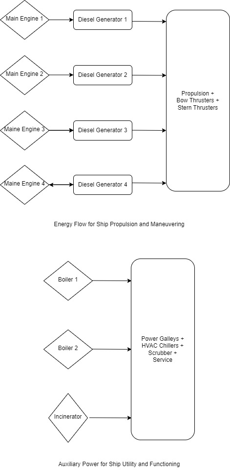

## Cruise Ship Performance Analysis
## Table of Contents
1. [Task Overview](#taskoverview)
2. [Prerequisites](#prerequisites)
3. [Installation](#installation)
4. [Usage](#usage)
5. [Details](#details)
6. [Conclusion](#conclusion)

### Task Overview
The task aims to analyze the dataset provided for two cruise ships (Vessel 1 and Vessel 2) to develop a narrative explaining their performance trends. Further, the analysis aims to efficiency, power consumption, and other key performance indicators (KPIs) relevant to the vessels and their components. The KPIs are selected based on domain understanding and International regulatory requirements for shipping.

### Prerequisites
Ensure you have the following software installed on your system:

- Python 3 or higher
- 4 core processor or higher
- have the data file as  data.csv in data/ directory. 

### Installation
1. Clone the repository:
```
git clone https://github.com/AKktk/Cruise_Performance_Analysis.git
cd Cruise_Performance_Analysis
```
2. Place the data/data.csv in the repository

### Usage
- Use ```make``` to run the Makefile for entire scripts, alternatively: 

1. Run the utility functions with : 
```python utility.py```
2. Run the trends script for resampling with : 
```python trends.py```
3. Run the plot.py script for visualizing the trend in time and mutual relationships
```python plot.py```
4. KPI Computation happens in the script kpi_computation.py run
```kpi_computation.py```
5. Time Forecasting for the dataset is done in: forecast.py run
```forecast.py```
6. The major analyses, visualizations and conclusions are all in eda.ipynb. This is a jupyer notebook where all the scripts are imported, and functions can be run cell by cell.

### Details:
The eda.ipynb notebook is the major skeleton of analysis. It imports scripts and runs functions to perform all analysis. It is built functionally, and that offers the advantage for user to visualize and analyse any pair of features or trends for themselves by just selecting it from the list of features. The important few trends and patterns as seen have been highlighted as charts already but the notebook offers the flexibility to the user to delve deeper on their own. This functionality is further highlighted as comments and notes within the notebook. This also makes sure that the notebook is not overwhelming or cluttered for a first time user. The notebook is also uploaded as a pdf report of analysis.

- utility.py/
    - pick_vessel(dataframe, 'Vessel Name') : function to pick the vessel for analysis
    - impute_time_series(dataframe, columns to impute, method) : function to impute time series data set by interpolating between non-missing rows
    - drop_columns(Dataframe, columns_to_drop) : function to drop any select columns for further analysis/forecasting

- trends.py/
    - resample(dataframe): function to resample the granular data into hourly, daily, weekly and monthly levels

- plot.py/
    - feature_distribution : Plots histograms to visualize feature distributions of a dataframe
    - feature_boxplot : Used for comparing the feature distributions of two or more vessels. It uses a candlestick pattern, with the body indicating 1st and 3rd quartiles, with the whiskers indicating the values beyod.
    - trend_plot : Plots a grid of 4 graphs hourly, daily, weekly and monthly to plot the chosen parameter against time from a dataframe
    - pair_plot : Plots a grid of 4 graphs hourly, daily, weekly and monthly to plot two chosen parameters against each other from a time-series dataframe

- kpi_computation.py/
    - compute_kpis : It computes 3 KPIs for the analysis and forecasting. The KPIs are then used in pair plots, trend analysis and also in forecasts. Method involves the understanding of Energy Flow Diagram as plotted by me. The detailed calculation is explained in the notebook.
    The energy flow diagram:

    

- forecast.py/
    - sarimax_forecast : The function finds the best hyperparameters that fit the curve to forecaast with minimum AIC index
    - best_forecast : sarima forecasting model that takes in the already computed best parameters so that a hyperparameter tuning is not necessary every time. It is the application function after training. Can be directly applied with the best parameters to a new unseen dataset

eda.md is the report generated from the eda.ipynb if a user just wants to skim through major analyses and results without analyzing code.
report.pdf is the pdf format for it.

### Conclusion
After loading the data, I jump into a distribution and multi-collinearity analysis. This is followed by a trend analysis and pair-plots at a more aggrregated time level. This is followed by KPI definition, analysis and lastly a forecast model that is based on only external geographical features and ship performance requiremnt. None of these features have been used in derivation of KPIs and can be available before the cruise starts. This helps in pre-planning and optimizing the cruise better.

-Thanks **Karthik Ananthakrishnan**

### Further 
For further analysis I found a multivariate time-series clustering algorithm: https://github.com/davidhallac/TICC, but it requires additional download and setup.
The 